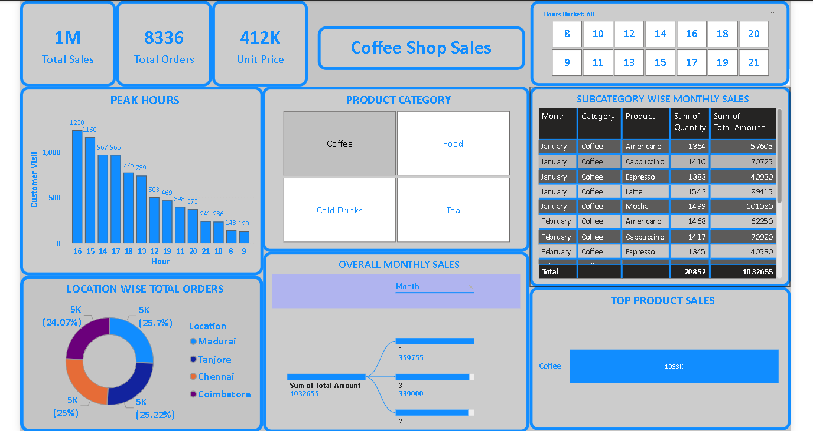

# ☕ Coffee Shop Sales Analysis Dashboard

## 📌 Project Overview
This project focuses on analyzing coffee shop sales data to identify **peak sales hours**, **product category performance**, and **location-wise order distribution**.  
The goal is to provide **business insights** using **Python for data preprocessing** and **Power BI for interactive visualization**.

---

## 🛠️ Tools & Technologies
- **Python** (Pandas, Matplotlib)
- **Power BI Desktop**
- **CSV Dataset**
- **Jupyter Notebook**

---

## 📂 Dataset Description
The dataset contains transactional coffee shop sales data with the following key fields:
- Order_Date  
- Order_Time  
- Product  
- Category  
- Quantity  
- Unit_Price  
- Total_Amount  
- Location  

Additional engineered columns:
- Hour  
- Peak_Hour  
- Day_Name  
- Month_Name  
- Is_Weekend  

---

## 🔄 Data Preprocessing (Python)
Data preprocessing and feature engineering were done using Python:
- Converted date and time columns
- Extracted **hour** from order time
- Created **peak hour flags** (Morning & Evening peaks)
- Added weekday/weekend indicators
- Exported a clean CSV file for Power BI

---

## 📊 Power BI Dashboard Features
The Power BI dashboard includes:

### 🔹 KPI Cards
- Total Sales  
- Total Orders  
- Unit Price  

### 🔹 Interactive Analysis
- **Hourly sales trend** to identify peak hours
- **Product category slicer (tile style)** for dynamic filtering
- **Location-wise total orders**
- **Top product sales**
- **Monthly sales trend**

All visuals are fully interactive — selecting a product category dynamically updates the entire dashboard.

---

## 📈 Key Insights
- Morning (6–11 AM) and evening (4–11 PM) are peak sales hours
- Coffee category contributes the highest revenue
- Sales are evenly distributed across locations with slight variations
- Product performance varies significantly by category and time

---

## 🖼️ Dashboard Preview

---
